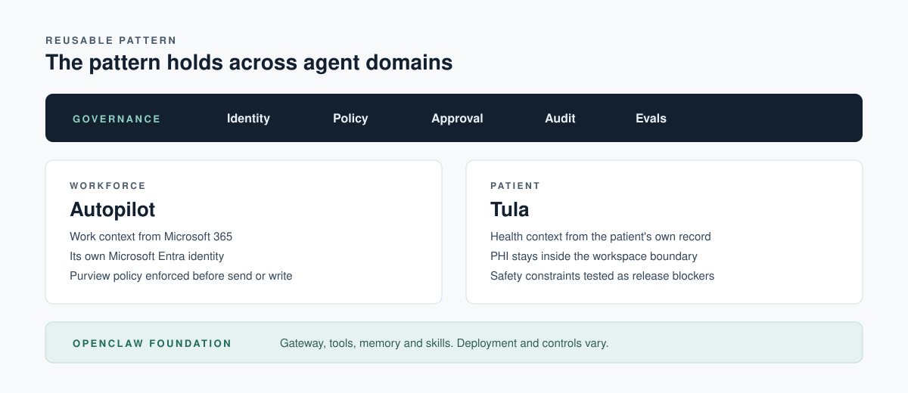

<p align="center">
  
</p>

<p align="center">
  <a href="docs/slide-notes.md"></a>
  <a href="docs/fact-check.md"></a>
  <a href="skills/visit-prep-lite/SKILL.md"></a>
  <a href="LICENSE"></a>
</p>

<p align="center">
  Companion repository for the talk given at the <b>Modern Workplace Conference Manila</b> (29 September 2026)<br>
  and the <b>Modern Work Conference Kuala Lumpur</b> (MWCKL 2026) by <b>Paul Swider</b>, RealActivity.
</p>

---

## The talk in one paragraph

Agents have stopped waiting for prompts. On 25 September 2026 Microsoft introduced a new Copilot built around Home, Code and **Autopilot**, a persistent agent (formerly Microsoft Scout) with its own identity that keeps working after you log off. Scout was built on the open source **OpenClaw** runtime. Once software acts on your behalf, a good demo is no longer enough. You need evidence that holds up after the action. This talk walks through the four layers that produce that evidence, then proves them live with **Tula**, an open source patient agent built on the same OpenClaw foundation and gated by **Microsoft Waza** behavior evaluations.

> **Build agents you can interrogate.** After they act, the evidence must still be there.

## Four layers of evidence

| Layer | The question it answers | Where it shows up in the talk |
| --- | --- | --- |
| **Runtime** | What actually executes? | OpenClaw gateway, tools, memory, channels ([architecture](docs/architecture.md)) |
| **Skills** | When should it act, and when must it not? | `USE FOR` and `DO NOT USE FOR` contracts in `SKILL.md` ([sample](skills/visit-prep-lite/SKILL.md)) |
| **Boundary** | What data can move, and who approved it? | Entra identity, Purview policy, human sign-off, PHI kept in the workspace ([governance](docs/governance.md)) |
| **Tests** | What proves the behavior, before and after release? | Waza structural checks on every PR plus live behavior gates ([release gates](docs/release-gates.md)) |

## Start here

| If you want to... | Go to |
| --- | --- |
| Revisit a slide and follow its sources | [Slide by slide notes](docs/slide-notes.md) |
| See which claims were checked and against what | [Fact check](docs/fact-check.md) |
| Understand the OpenClaw agent architecture | [Architecture](docs/architecture.md) |
| Close the gap between self-hosted and governed | [Governance checklist](docs/governance.md) |
| Turn a passing demo into a release gate | [Release gates with Waza](docs/release-gates.md) |
| Re-run the three live demos yourself | [Demo guide](docs/demos.md) |
| Try the pattern on your own machine in five minutes | [Hands-on lab](#hands-on-lab) |
| Browse every link from the talk, grouped | [Resources](RESOURCES.md) |

## What Microsoft announced, and why it matters here

On 25 September 2026 Microsoft introduced the new Copilot, organized around three capabilities.

| Capability | What it does | Availability at announcement |
| --- | --- | --- |
| **Home** | Brings Chat and Cowork together as the new starting point, with Word, Excel and PowerPoint inside Copilot | Rolling out through the Frontier program in the coming weeks |
| **Code** | Builds apps, trackers, dashboards and workflows from natural language, powered by the same technology as GitHub Copilot, sandboxed and hostable in your tenant | Rolling out through Frontier, with Copilot Managed Runtime in preview |
| **Autopilot** | A persistent, proactive agent with its own identity, memory and workspace. Previously named Microsoft Scout | Private preview expanding at the end of September 2026 |

Cowork, Code and Autopilot run on usage based billing in Copilot Credits on top of the Microsoft 365 Copilot seat, and those services stay off until an admin creates a spending policy. Sources and exact wording are in the [fact check](docs/fact-check.md).

The governance story is the part that travels. Microsoft describes every Scout agent as operating under **its own governed Entra identity**, reaching **only approved resources**, allowing **human sign-off on sensitive actions**, and enforcing **Purview data protection before anything is sent or written**. Microsoft also said it is contributing **policy conformance upstream to OpenClaw**. Those are exactly the controls a self-hosted agent does not get for free.

<p align="center">
  
</p>

## Hands-on lab

This repo ships a small, fully synthetic skill called [`visit-prep-lite`](skills/visit-prep-lite/SKILL.md) with a Waza evaluation suite that mirrors the five behavior dimensions from the talk. It is a teaching sample, not medical software.

```bash
# 1. Install Waza (macOS, Linux, WSL or Git Bash)
curl -fsSL https://raw.githubusercontent.com/microsoft/waza/main/install.sh | bash
#    Native Windows PowerShell
#    irm https://raw.githubusercontent.com/microsoft/waza/main/install.ps1 | iex

# 2. Inspect the contract
waza check skills/visit-prep-lite

# 3. Prove every promise in SKILL.md has a test behind it
waza spec verify skills/visit-prep-lite evals/visit-prep-lite/eval.yaml

# 4. Structural lane, no model or API key needed (what runs on every PR)
waza run evals/visit-prep-lite/eval.mock.yaml --skip-graders -v

# 5. Live lane, real model behind GitHub Copilot auth (what gates a release)
waza run evals/visit-prep-lite/eval.yaml -v
```

Verified with Waza v0.38.8 on 30 September 2026. `check` reports a High compliance score within the 500 token budget, `spec verify` covers 9 of 9 contract requirements, and the structural lane exits cleanly.

Then try the third demo offline. The [Trust Bridge explainer](tools/trust-bridge/README.md) reads a synthetic audit log and answers the question from the slide, *what prevented the action, and can we prove it?*

```bash
python3 tools/trust-bridge/explain.py --blocked
python3 tools/trust-bridge/explain.py --event evt-0007
```

## Repository map

```text
.
├── README.md                  you are here
├── RESOURCES.md               curated first-party links
├── docs/
│   ├── slide-notes.md         all 16 slides with notes and sources
│   ├── fact-check.md          every factual claim, status and source
│   ├── architecture.md        OpenClaw runtime, channels, skills, workspace
│   ├── governance.md          self-hosted vs governed, mapped to Microsoft controls
│   ├── release-gates.md       structural vs live evaluation with Waza
│   ├── demos.md               how to re-run the three live demos
│   └── glossary.md
├── skills/visit-prep-lite/    sample skill contract (SKILL.md)
├── evals/visit-prep-lite/     Waza suite, five behavior dimensions, synthetic fixtures
├── tools/trust-bridge/        offline "what blocked it and can we prove it" explainer
├── assets/                    banner and diagrams
└── .github/workflows/         structural gate and link check on every PR
```

## Related projects

| Project | What it is |
| --- | --- |
| [realactivity/tula](https://github.com/realactivity/tula) | Open source patient agent skill layer on OpenClaw, with the Patient Agent Eval Standard v0.1 (78 tasks across 8 skills plus composition) |
| [microsoft/waza](https://github.com/microsoft/waza) | Microsoft's CLI and framework to create, test, measure and improve agent skills |
| [openclaw/openclaw](https://github.com/openclaw/openclaw) | The open source personal agent runtime that Scout and Tula both build on |

## About the speaker

**Paul Swider** is Founder, CEO and Chief AI Officer of [RealActivity](https://realactivity.ai), a healthcare AI company. Microsoft MCT and MVP alumni, creator of Tula, co-founder of the Wheelhouse AI Center of Excellence, Cloud Wars healthcare AI analyst and founder of BOSHUG, the Boston Healthcare Cloud and AI community. Thirty years in healthcare technology, and still too many tabs open.

## Disclaimer

Everything in this repository uses synthetic data. Nothing here is a medical device or clinical decision support, and nothing here should be used with real patient information. Product names and availability reflect public Microsoft statements as of 30 September 2026 and will change. Check the linked sources for the current state.

## License

Code and docs are released under the [Apache License 2.0](LICENSE). Microsoft, Copilot, Entra, Purview and related names are trademarks of Microsoft. OpenClaw is stewarded by the OpenClaw Foundation. Tula and RealActivity are trademarks of RealActivity.
