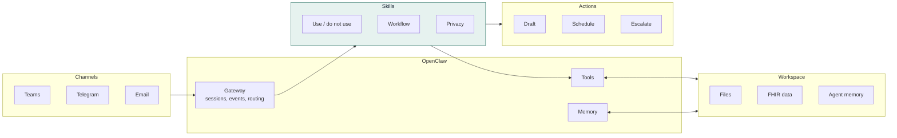

# Architecture

How an OpenClaw based agent is put together, and where each of the four evidence layers lives.

## The flow on slide 7



**Channels depend on the deployment. Skills and tools define the boundary.** Two agents on the same runtime and the same model can carry completely different risk, because what they are allowed to do is decided by the skills and tools they are given.

## Mapping to the four layers

| Layer | In OpenClaw | In a Microsoft 365 Autopilot | In Tula |
| --- | --- | --- | --- |
| **Runtime** | Gateway, tools, memory, channels, sandbox configuration | OpenClaw core wrapped with Microsoft's enterprise controls | Single self hosted VM, private workspace |
| **Skills** | `SKILL.md` folders loaded by the gateway | Microsoft 365 connections, MCP servers and Work IQ context | Eight health skills with explicit `USE FOR` and `DO NOT USE FOR` |
| **Boundary** | Pairing for unknown senders, sandboxing, tool allowlists | Entra identity per agent, approved resources, Purview DLP and labels, human sign-off | PHI stays in `~/.openclaw/workspace/`, drafts never auto-send, sender allowlist |
| **Tests** | Your own | Policy conformance checks with audit trails | Waza suites, 78 tasks, release blockers in CI |

## Security defaults worth knowing

The OpenClaw README is explicit that inbound messages are untrusted input, that DM capable channels pair unknown senders by default, and that tools run on the host for the main session unless you configure sandboxing. Read these before connecting other users or exposing a gateway.

- [OpenClaw security guide](https://docs.openclaw.ai/gateway/security)
- [Sandboxing guide](https://docs.openclaw.ai/gateway/sandboxing)
- [Exposure runbook](https://docs.openclaw.ai/gateway/security/exposure-runbook)

## What a skill contract looks like

A skill is a folder with a `SKILL.md` whose frontmatter tells the runtime when to load it. The description carries the routing contract, and the body carries the workflow and the privacy rules.

```markdown
---
name: prep-my-visit
description: "Prepare an IPS-aligned visit-prep package from patient health data.
  USE FOR: upcoming visit prep, lab opportunities, and portal snippets.
  DO NOT USE FOR: diagnosis/treatment, insurance/billing tasks,
  or PHI transfer outside the workspace."
---
```

Waza reads the same `USE FOR` and `DO NOT USE FOR` lines. `waza new eval` scaffolds positive and negative trigger tasks from them, and `waza spec verify` checks that every promise in the contract is exercised by at least one task. See this repo's [`visit-prep-lite`](../skills/visit-prep-lite/SKILL.md) for a complete, runnable example.

## References

- [OpenClaw architecture](https://docs.openclaw.ai/concepts/architecture)
- [OpenClaw gateway](https://docs.openclaw.ai/gateway)
- [OpenClaw channels](https://docs.openclaw.ai/channels)
- [OpenClaw skills](https://docs.openclaw.ai/tools/skills)
- [Tula architecture](https://github.com/realactivity/tula/blob/main/docs/architecture.md)
- [Agent Skills specification](https://agentskills.io)
