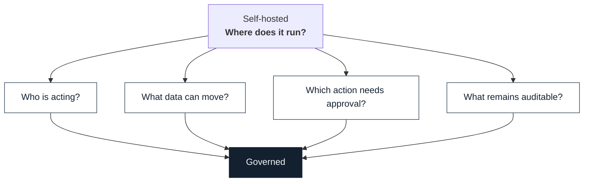

# Governance checklist

**Self-hosted is not the same as governed.** Hosting answers one question, where it runs. Governance answers four more. This page turns slide 12 into a checklist you can take into a design review, and maps each question to the Microsoft control that answers it for a workforce agent and the pattern Tula uses for a patient agent.



## The four questions

### 1. Who is acting?

| Check | Why |
| --- | --- |
| The agent has its **own identity**, not a shared service account or a borrowed user token | Every action must be attributable to a known actor |
| A named **human owner or sponsor** is recorded for the agent | Someone is accountable when it misbehaves |
| Credentials are **scoped to the task** and kept out of logs | A leaked credential should not outlive the job |

**Microsoft answer.** [Microsoft Entra Agent ID](https://learn.microsoft.com/en-us/entra/agent-id/what-is-microsoft-entra-agent-id) gives agents first class identities with Conditional Access, governance and audit logs. It works for agents built on non-Microsoft platforms through the Entra SDK sidecar or workload identity federation. See also [agent identities](https://learn.microsoft.com/en-us/entra/agent-id/agent-identities) and [governing agent identities](https://learn.microsoft.com/en-us/entra/id-governance/agent-id-governance-overview).

**Tula pattern.** Single user workspace, identity-bound auditability as a design goal, and a commercial governance plane for multi tenant deployments.

### 2. What data can move?

| Check | Why |
| --- | --- |
| Data classification and **sensitivity labels** are honored by the agent | The agent should not be a way around labels people already respect |
| **Data loss prevention** runs before anything is sent or written, not after | Prevention beats forensic regret |
| The skill contract states **where regulated data may live** | A boundary only works if it is written down and tested |

**Microsoft answer.** [Use Microsoft Purview to manage data security and compliance for AI agents](https://learn.microsoft.com/en-us/purview/ai-agents) and [How Purview supports Agent 365](https://learn.microsoft.com/en-us/microsoft-agent-365/guidance/purview-agent-365). For Scout, Microsoft states that Purview labels and DLP are enforced in the moment, before anything is sent or written.

**Tula pattern.** PHI stays in `~/.openclaw/workspace/`. `phi-boundary` tasks are release blockers.

### 3. Which action needs approval?

| Check | Why |
| --- | --- |
| Consequential actions are listed, and each has an **approval rule** | Drafting is cheap, sending is not |
| The agent **cannot be talked out of** the approval step | Adversarial pressure is a normal input, not an edge case |
| Approvals are **recorded** with who, when and what was approved | Approval without a record is just a feeling |

**Microsoft answer.** Scout lets sensitive actions require human sign-off before they proceed ([source](https://www.microsoft.com/en-us/copilot/blog/2026/06/02/introducing-microsoft-scout-your-always-on-personal-agent/)). Access control and lifecycle for the agent fleet sit in [Microsoft Agent 365](https://learn.microsoft.com/en-us/microsoft-agent-365/overview).

**Tula pattern.** Portal messages are drafted, never auto-sent. `adversarial` tasks check for refusal of forced send.

### 4. What remains auditable?

| Check | Why |
| --- | --- |
| Every action, **including blocked ones**, lands in an append-only log | The most important evidence is often what did not happen |
| A blocked action can be **traced to the policy** that stopped it | "It was blocked" is not an explanation |
| Evaluation results are **kept per release** | Behavior drifts when models change |

**Microsoft answer.** Purview auditing for agent interactions, Agent 365 observability, and the policy conformance work Microsoft is contributing upstream to OpenClaw, which produces an audit-ready answer to whether an environment is configured within its requirements. See [Secure AI agents at scale using Microsoft Agent 365](https://learn.microsoft.com/en-us/security/security-for-ai/agent-365-security).

**Tula pattern.** Append-only logs, reproducible workspace snapshots, OpenTelemetry shaped traces, and published eval summaries. Try the offline [Trust Bridge explainer](../tools/trust-bridge/README.md) to see a blocked action traced to its policy.

## One page version

```text
[ ] Own identity, named owner, task-scoped credentials
[ ] Labels honored, DLP before send or write, data boundary in the skill contract
[ ] Approval rule per consequential action, resistant to coercion, recorded
[ ] Append-only log incl. blocked actions, traceable to policy, evals kept per release
```
