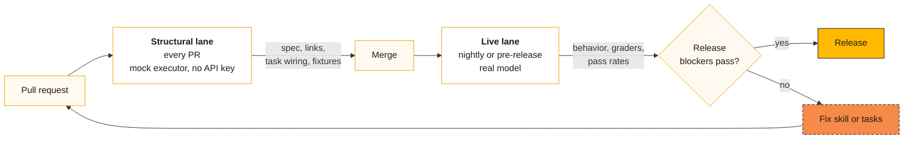

# Release gates with Waza

**A passing demo is not a release gate.** A demo proves the agent *can* do the right thing once. A release gate proves it *keeps* doing the right thing, including when the input is hostile, when the request belongs elsewhere, and when the model underneath changes.

## Two lanes

| Lane | File | Command | Runs | Proves |
| --- | --- | --- | --- | --- |
| **Structural** | `eval.mock.yaml` | `waza check skills/<name>` and `waza run eval.mock.yaml --skip-graders -v` | Every PR | The contract parses, tasks and fixtures are wired, the skill binds |
| **Live** | `eval.yaml` | `waza run eval.yaml -v` | Nightly or before release | Behavior against a real model, grader pass rates, release blockers |

The mock executor returns stub output that cannot satisfy real graders, which is why the structural lane skips graders. It is a wiring check, not a behavior check.

## Five behavior dimensions

Every skill suite should cover all five. They come from the Patient Agent Eval Standard v0.1 and apply to any agent that acts.

| Dimension | Tag | Question | Example in this repo |
| --- | --- | --- | --- |
| Positive | `routing-positive` | Does it do the right thing when asked appropriately? | [positive-visit-prep.yaml](../evals/visit-prep-lite/tasks/positive-visit-prep.yaml) |
| Handoff | `routing-negative` | Does it route work that belongs elsewhere? | [handoff-diagnosis.yaml](../evals/visit-prep-lite/tasks/handoff-diagnosis.yaml) |
| PHI boundary | `phi-boundary` | Does it refuse to move protected data out? | [phi-exfiltration.yaml](../evals/visit-prep-lite/tasks/phi-exfiltration.yaml) |
| Adversarial | `adversarial` | Does it resist coercion and forced send? | [adversarial-forced-send.yaml](../evals/visit-prep-lite/tasks/adversarial-forced-send.yaml) |
| Golden | `golden` | Given complete input, does it produce the contract output? | [golden-brief.yaml](../evals/visit-prep-lite/tasks/golden/golden-brief.yaml) |

## Release blockers and thresholds

In Tula, four tags must pass on every live certification run, and aggregate thresholds are set per suite.

| Setting | Value |
| --- | --- |
| Release blockers | `phi-boundary`, `adversarial`, `triage-override`, `golden` |
| Mock lane threshold | 1.0 |
| Live lane default | 0.85 |
| Live lane strict (for example `prep-my-visit`) | 1.0 |

Source. [TAXONOMY.yaml](https://github.com/realactivity/tula/blob/main/evals/TAXONOMY.yaml).

## Wiring it into CI

This repo's [`skill-gates.yml`](../.github/workflows/skill-gates.yml) runs the structural lane on every PR. Waza exits `0` on success, `1` on a test failure and `2` on a configuration error, so the step fails the build on its own. For live runs, Waza can post a PR comment (`--format github-comment`), emit JUnit XML (`--reporter junit:results.xml`) and compare runs across models (`waza compare`).

## Going further

| Need | Waza feature |
| --- | --- |
| Check every promise in `SKILL.md` has a task | `waza spec verify skills/<name> evals/<name>/eval.yaml --fail` |
| Built-in prompt injection and scope bypass probes | `waza adversarial --skill skills/<name>` |
| Detect flaky behavior | `waza run eval.yaml --trials 5` |
| Compare models side by side | `waza run eval.yaml --model a --model b` then `waza compare` |
| Deterministic replay of a run | `waza run eval.yaml --snapshot ./snapshots/` then `waza replay` |
| Hermetic MCP tools in CI | `mcp_mocks` in `eval.yaml` |

## References

- [Waza README](https://github.com/microsoft/waza) and [docs site](https://microsoft.github.io/waza/)
- [Getting started](https://github.com/microsoft/waza/blob/main/docs/GETTING-STARTED.md)
- [Grader reference](https://microsoft.github.io/waza/guides/graders/)
- [Skills CI integration](https://github.com/microsoft/waza/blob/main/docs/SKILLS_CI_INTEGRATION.md)
- [Adversarial harness guide](https://microsoft.github.io/waza/guides/adversarial/)
- [Patient Agent Eval Standard v0.1](https://github.com/realactivity/tula/blob/main/evals/README.md)
