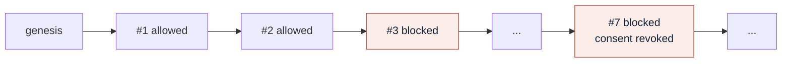

# Trust Bridge explainer

An offline, standard library only version of **Live demo 3**. It walks one interaction across the bridge between a patient agent and a workforce agent and answers the question on the slide.

> **What prevented the action, and can we prove it?**

| Slide step | Command | What you see |
| --- | --- | --- |
| **01 Filter** | `python3 tools/trust-bridge/explain.py --blocked` | Every interaction that consent or policy stopped |
| **02 Select** | `python3 tools/trust-bridge/explain.py --event evt-0007` | One interaction with its bridge and consent state |
| **03 Explain** | same command | The policy that fired, its Microsoft 365 analogue, and the recorded reason |
| **Prove** | `python3 tools/trust-bridge/explain.py --verify` | The audit hash chain is intact |
| **Break it** | `python3 tools/trust-bridge/explain.py --tamper evt-0007` | Quietly flipping a past decision to "allowed" breaks the chain at that entry |

Requires Python 3.8 or later. No packages to install.

## How the proof works

Each audit entry stores the SHA-256 hash of the entry before it. Change any past record, even one word of a reason, and the chain no longer links from that point on. That is the difference between a log that says what happened and a log you can defend.

A production system would add signatures, write-once storage and an external timestamp. Hash chaining is the smallest idea that makes the point on stage.

## Data

| File | Contents |
| --- | --- |
| [`data/consents.json`](data/consents.json) | Three bridges. One active for scheduling, one revoked, one active for the visit brief only |
| [`data/policies.json`](data/policies.json) | Three policies, each mapped to the Microsoft control it mirrors |
| [`data/audit-log.jsonl`](data/audit-log.jsonl) | Ten hash-chained audit entries, including held and blocked actions |
| [`make_demo_log.py`](make_demo_log.py) | Rebuilds the audit log if you edit the events |

Everything here is synthetic. The patient, agents and consents are fictional.
